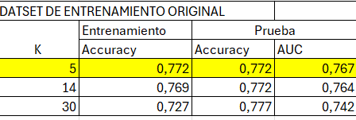

```{r setup, include=FALSE}
knitr::opts_chunk$set(echo = TRUE)
```

## KNN


```{r, echo=FALSE}
library(readxl)
library(caret)
library(MLmetrics)
library(ROCR)
library(e1071)
```


### Preparación del Dataset
```{r}
cereal <- read.csv("C:/Users/willi/GITHUB/MACHINE-LEARNING/Semana 5/cereal2.csv", sep=";")
str(cereal)
```


```{r}
##Crea un set completo de variables dummy
cerealeswin<-dummyVars("~.",data=cereal)
cerealesfin<-as.data.frame(predict(cerealeswin,newdata=cereal))

cerealesfin$desayunoOtros <- NULL
colnames(cerealesfin) <- make.names(colnames(cerealesfin))

#Dataset de entrenamiento y prueba
set.seed(1)
#aquí se define el tamaño de la muestra, en este caso entrenamiento tendrá el 75% de los casos
sample <- sample.int(nrow(cerealesfin), floor(.75*nrow(cerealesfin)))
cereal.train <- cerealesfin[sample, ]
cereal.test <- cerealesfin[-sample, ]

cereal.train1 <- cereal.train
cereal.test1 <- cereal.test

# Volvemos la columna que queremos predecir de tipo 'Factor'
# Lo hacemos para el conjunto de entrenamiento y de prueba
cereal.train$desayunoAvena<-as.factor(cereal.train$desayunoAvena)
cereal.train1$desayunoAvena<-as.factor(cereal.train1$desayunoAvena)
cereal.test$desayunoAvena<-as.factor(cereal.test$desayunoAvena)
cereal.test1$desayunoAvena<-as.factor(cereal.test1$desayunoAvena)
```

```{r}
str(cereal.train)
```

```{r}
head(cereal.train, 3)
```

### Validadción Cruzada

```{r}
# creo parámetros de validación cruzada
set.seed(1)
cross<-trainControl(method="cv",number=10)
modeloknn1<-train(desayunoAvena~.,method="knn",
                  tuneGrid=expand.grid(k=1:30),
                  trControl=cross,
                  metric="Accuracy",
                  data=cereal.train)
```

```{r}
modeloknn1
plot(modeloknn1)
```

---

```{r}
set.seed(1)

levels(cereal.train$desayunoAvena) <- make.names(levels(factor(cereal.train$desayunoAvena)))
# creo parámetros de validación cruzada
cross<-trainControl(method="cv",number=5,
                    classProbs = TRUE,
                    summaryFunction =prSummary)

modeloknn2<-train(desayunoAvena~.,method="knn",
                  tuneGrid=expand.grid(k=1:30),
                  trControl=cross,
                  metric="AUC",
                  data=cereal.train)
```

```{r}
modeloknn2
plot(modeloknn2)
```

De los anteriores de validacion cruzada, vemos que existen algunos K buenos que vamos a comparar entre sí: K= [5, 14, 30]

## Modelo KNN

### K=5

```{r}
# MODELO CON K = 5
set.seed(1)
test_pred = knn3(desayunoAvena~., data=cereal.train1, k = 5)
```

```{r}
# Desempeño en entrenamiento.  K = 5
predmod <- predict(test_pred, cereal.train1, type = "prob")
pronknn<-ifelse(predmod[,2] > 0.5 ,1, 0)
confknn<-confusionMatrix(as.factor(pronknn),
                          cereal.train1$desayunoAvena, positive = "1")
confknn$table
confknn$overall
confknn$byClass
```

```{r}
# Desempeño en prueba.  K = 5
predmod <- predict(test_pred, cereal.test1, type = "prob")
pronknn<-ifelse(predmod[,2] > 0.5 ,1, 0)
confknn<-confusionMatrix(as.factor(pronknn),
                          cereal.test1$desayunoAvena, positive = "1")
confknn$table
confknn$overall
confknn$byClass
```

```{r}
# CURVA ROC y AUC.  K = 5

#crear objeto de predicciones
pr<-prediction(pronknn,cereal.test$desayunoAvena)
#creacion del objeto de la curva
curvaROC<-performance(pr,measure="tpr",x.measure="fpr")
#grafico de la curva
plot(curvaROC)

#calcular el AUC
auc<-performance(pr,measure = "auc")
auc <- auc@y.values[[1]]
#ver el AUC
auc

```

### K=14


```{r}
# MODELO CON K = 14
set.seed(1)
test_pred = knn3(desayunoAvena~., data=cereal.train1, k = 14)

```

```{r}
# Desempeño en entrenamiento.  K = 14
predmod <- predict(test_pred, cereal.train1, type = "prob")
pronknn<-ifelse(predmod[,2] > 0.5 ,1, 0)
confknn<-confusionMatrix(as.factor(pronknn),
                          cereal.train1$desayunoAvena, positive = "1")
confknn$table
confknn$overall
confknn$byClass

```

```{r}
# Desempeño en prueba.  K = 14
predmod <- predict(test_pred, cereal.test1, type = "prob")
pronknn<-ifelse(predmod[,2] > 0.5 ,1, 0)
confknn<-confusionMatrix(as.factor(pronknn),
                          cereal.test1$desayunoAvena, positive = "1")
confknn$table
confknn$overall
confknn$byClass

```

```{r}
# CURVA ROC y AUC.  K = 14

#crear objeto de predicciones
pr<-prediction(pronknn,cereal.test$desayunoAvena)
#creacion del objeto de la curva
curvaROC<-performance(pr,measure="tpr",x.measure="fpr")
#grafico de la curva
plot(curvaROC)

#calcular el AUC
auc<-performance(pr,measure = "auc")
auc <- auc@y.values[[1]]
#ver el AUC
auc

```

### K=30


```{r}
# MODELO CON K = 30
set.seed(1)
test_pred = knn3(desayunoAvena~., data=cereal.train1, k = 30)

```

```{r}
# Desempeño en entrenamiento.  K = 30
predmod <- predict(test_pred, cereal.train1, type = "prob")
pronknn<-ifelse(predmod[,2] > 0.5 ,1, 0)
confknn<-confusionMatrix(as.factor(pronknn),
                          cereal.train1$desayunoAvena, positive = "1")
confknn$table
confknn$overall
confknn$byClass

```

```{r}
# Desempeño en prueba.  K = 30
predmod <- predict(test_pred, cereal.test1, type = "prob")
pronknn<-ifelse(predmod[,2] > 0.5 ,1, 0)
confknn<-confusionMatrix(as.factor(pronknn),
                          cereal.test1$desayunoAvena, positive = "1")
confknn$table
confknn$overall
confknn$byClass

```

```{r}
# CURVA ROC y AUC.  K = 30

#crear objeto de predicciones
pr<-prediction(pronknn,cereal.test$desayunoAvena)
#creacion del objeto de la curva
curvaROC<-performance(pr,measure="tpr",x.measure="fpr")
#grafico de la curva
plot(curvaROC)

#calcular el AUC
auc<-performance(pr,measure = "auc")
auc <- auc@y.values[[1]]
#ver el AUC
auc

```

## Conclusión



- Se hace validación cruzada con 10 pliegues para determinar, por medio de la métrica 'Accuracy', el k más óptimo, dando como mejor resultado k=14. Sin embargo, por el principio de parcimonia, nosotros identificamos k=5 como el de mejor 'Accuracy'. Por otro lado, se hace validación cruzada de 5 pliegues para analizar la métrica 'AUC', dando como mejor número de vecinos k=30.

- Mejor Valor de K: Según las métricas de los 3 modelos entrenados, K = 5 parece ser la mejor opción. Proporciona un equilibrio adecuado entre la precisión y la capacidad de discriminación (AUC) tanto en el conjunto de entrenamiento como en el de prueba.

- Se entrenó y sintonizó un modelo de Machine Learning llamado 'KNN', el cual es un modelo sencillo que solo tiene un hiperparámetro (k: el número de vecinos). Para ello, utilizamos validación cruzada y comparación de las métricas 'Accuracy' y 'AUC' con el fin de entrenar el mejor modelo posible. Este modelo base nos servirá para tener un nivel de referencia con el que comparar otros modelos de Machine Learning que son más 'poderosos'.
